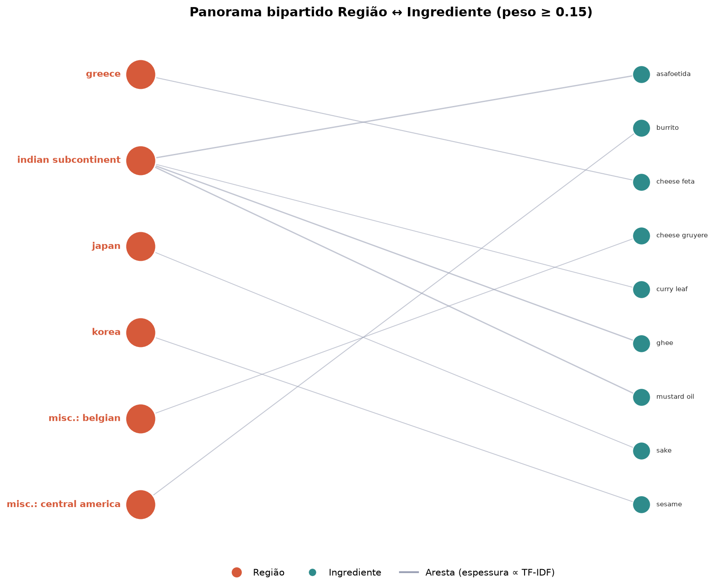
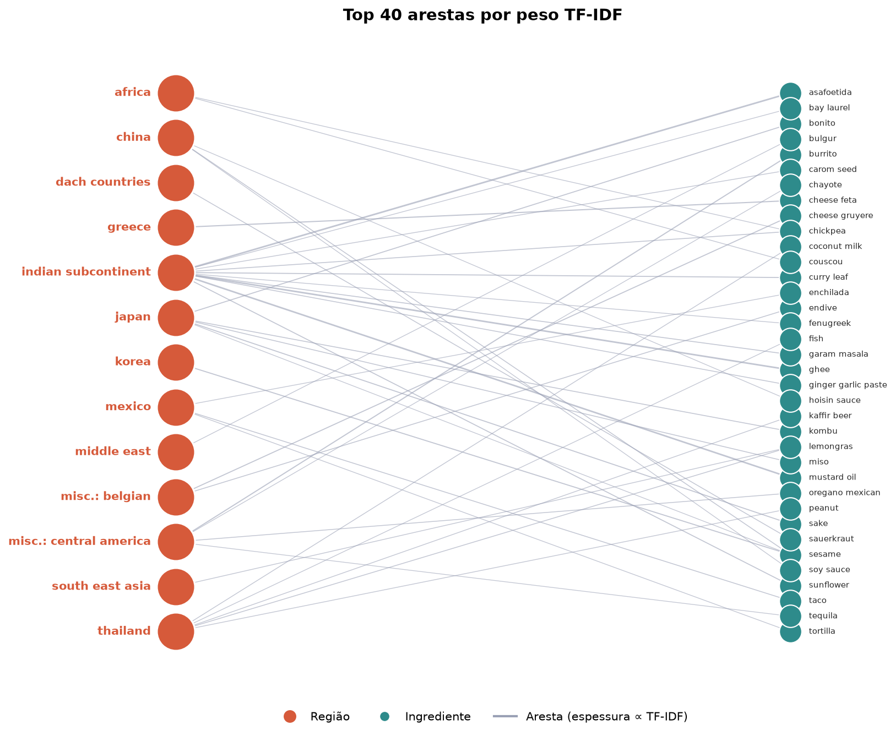
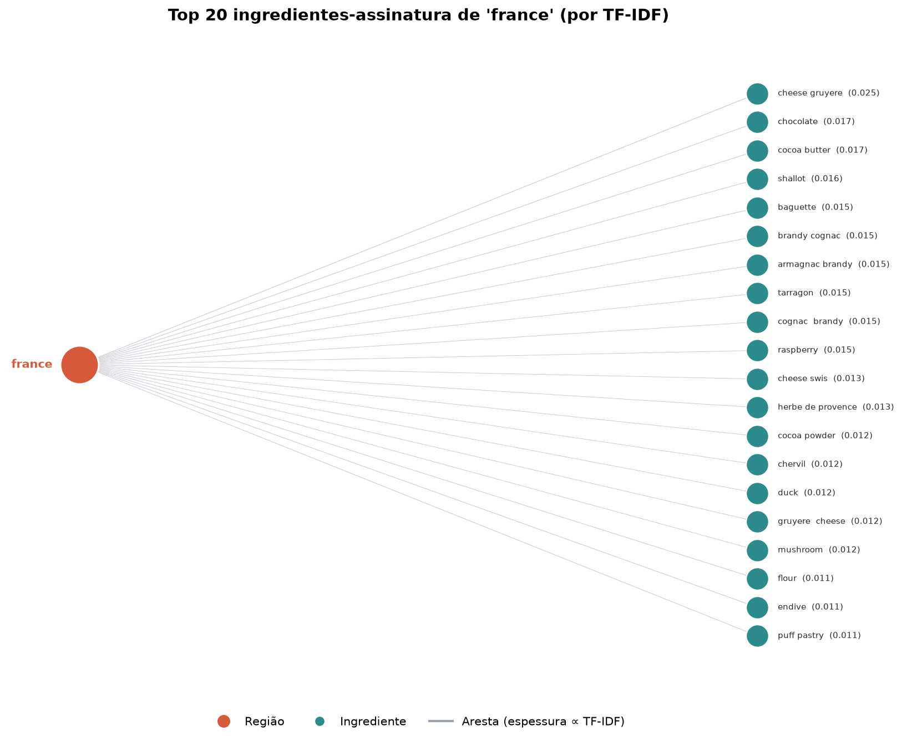
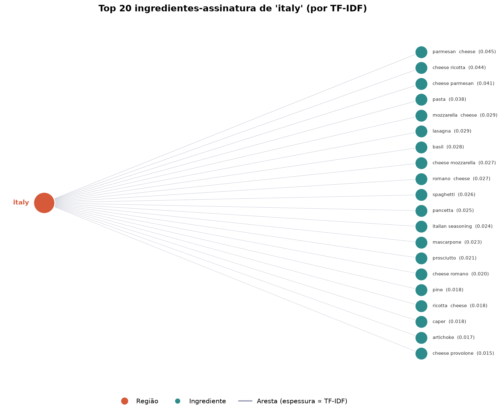
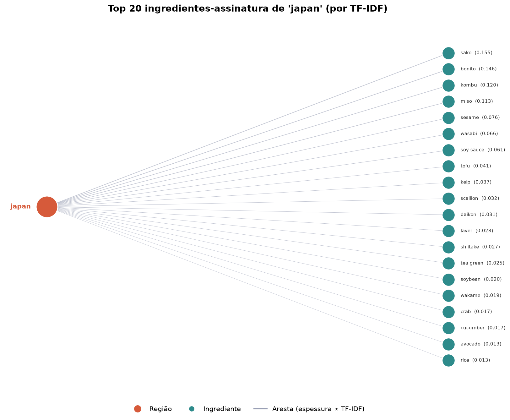
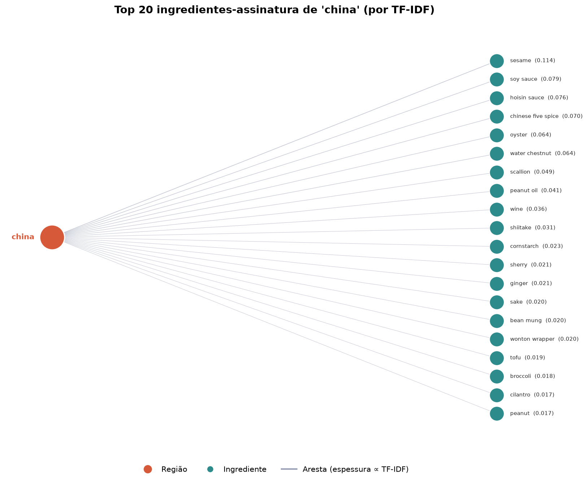
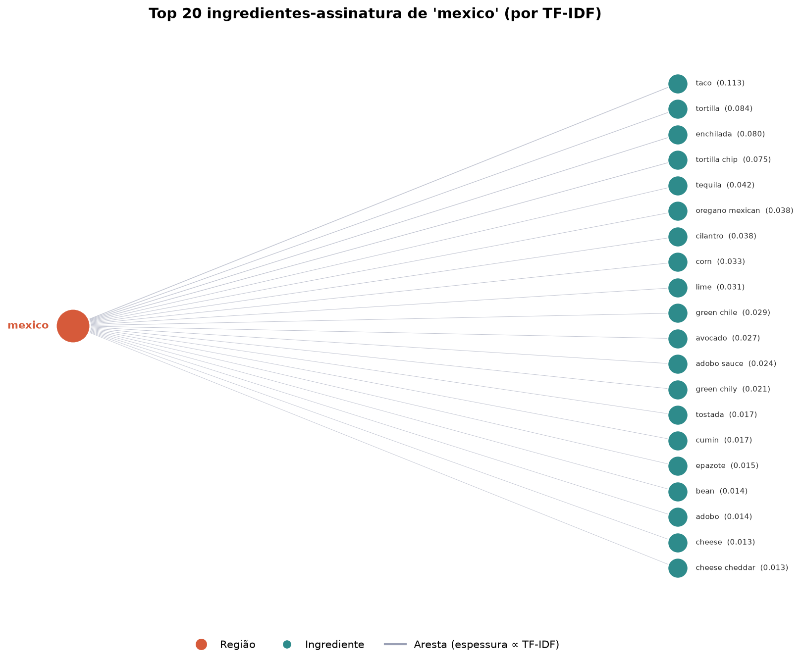
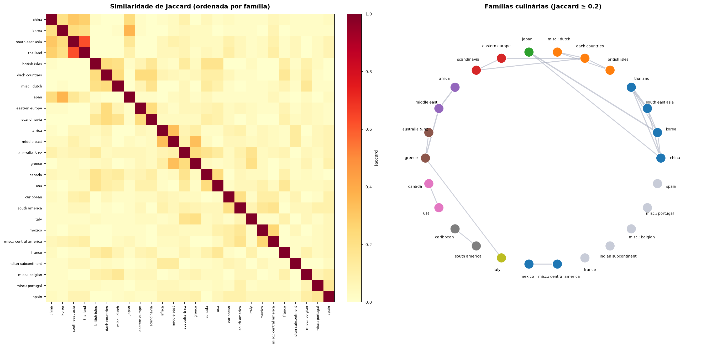

# Relatório de análise — grafo culinário (CulinaryDB)

> Pesos escolhidos nesta execução: **limiar de Jaccard = 0.2**, **percentil do cosseno = 10%**, **assinatura top-30**.

Grafo bipartido **região ↔ ingrediente** com pesos **TF-IDF**. Todos os números são calculados pelo código do grupo (grafo, BFS/fila, Bron-Kerbosch, Jaccard, cosseno); matplotlib é usado só para desenhar.

## 1. Panorama do grafo

- **26 regiões**, **666 ingredientes**, **7875 arestas** região↔ingrediente.
- Densidade bipartida: **45.5%**.
- Grau por região: min **49**, médio **302.9**, máx **623**.

| região | ingrediente | TF-IDF |
|---|---|---|
| indian subcontinent | asafoetida | 0.3256 |
| indian subcontinent | mustard oil | 0.317 |
| indian subcontinent | ghee | 0.317 |
| greece | cheese feta | 0.1931 |
| misc.: central america | burrito | 0.1832 |
| korea | sesame | 0.1639 |
| misc.: belgian | cheese gruyere | 0.1572 |
| japan | sake | 0.1547 |
| indian subcontinent | curry leaf | 0.1515 |
| japan | bonito | 0.1462 |

## 2. Assinatura regional (top ingredientes por TF-IDF)

- **africa**: couscou, chickpea, harissa, saffron, cumin, turmeric
- **australia & nz**: cheese feta, cheese parmesan, oat, pasta, salad dressing, artichoke
- **british isles**: buttermilk, whiskey, currant, baking soda, oat, rutabaga
- **canada**: oat, tart shell, cocoa powder, flax seed, blueberry, barbeque sauce
- **caribbean**: plantain french, scotch, rum, lime, mango, coconut milk
- **china**: sesame, soy sauce, hoisin sauce, chinese five spice, oyster, water chestnut
- **dach countries**: sauerkraut, caraway, flour, anise, veal, cocoa powder
- **eastern europe**: sauerkraut, dill, beet, caraway, poppy seed, cheese cottage
- **france**: cheese gruyere, chocolate, cocoa butter, shallot, baguette, brandy cognac
- **greece**: cheese feta, feta  cheese, phyllo, bread pita, oregano, dill
- **indian subcontinent**: asafoetida, ghee, mustard oil, curry leaf, sunflower, garam masala
- **italy**: parmesan  cheese, cheese ricotta, cheese parmesan, pasta, mozzarella  cheese, lasagna
- **japan**: sake, bonito, kombu, miso, sesame, wasabi
- **korea**: sesame, soy sauce, daikon, scallion, kombu, tofu
- **mexico**: taco, tortilla, enchilada, tortilla chip, tequila, oregano mexican
- **middle east**: bulgur, tahini, chickpea, bread pita, couscou, pomegranate
- **misc.: belgian**: cheese gruyere, endive, whiskey, prosciutto, flour, beer
- **misc.: central america**: burrito, oregano mexican, chayote, pie, tequila, cilantro
- **misc.: dutch**: treacle, meatloaf, currant, apple, flour, pie
- **misc.: portugal**: pimenta, bean kidney, kale, port wine, spanish  sage, paprika
- **scandinavia**: lingonberry, herring, cardamom, dill, bread rye, flour
- **south america**: cilantro, corn, lime, plantain french, milk condensed, tapioca
- **south east asia**: lemongras, fish, peanut, bean mung, vermicelli, coconut milk
- **spain**: saffron, spanish  sage, pimiento, chickpea, paprika, baguette
- **thailand**: lemongras, coconut milk, kaffir beer, peanut, fish, peanut butter
- **usa**: cajun seasoning, pecan, buttermilk, cheddar  cheese, corn, chocolate

## 3. Conectividade (Fila + BFS)

- Grafo **conexo**: alcançam-se 692/692 vértices.
- **Diâmetro região↔região: 2 arestas** (2 = compartilham um ingrediente).

**Ingrediente-ponte entre cozinhas distintas** (caminho mínimo BFS, desempate por TF-IDF):

| de | para | distância | ingrediente(s)-ponte |
|---|---|---|---|
| japan | mexico | 2 | sesame |
| italy | japan | 2 | parmesan  cheese |
| indian subcontinent | france | 2 | sunflower |
| scandinavia | thailand | 2 | cardamom |

## 4. Famílias de regiões (clique de Bron-Kerbosch sobre a similaridade)

- **Jaccard** (assinatura top-30), limiar 0.2: **21 arestas**.
- **Cosseno** (vetor TF-IDF completo), percentil 10% → limiar 0.3513: **32 arestas**.
- Concordância: acordo total 92.3%, Jaccard-de-arestas **35.9%**.

**Famílias por Jaccard:**
  - (4) china, korea, south east asia, thailand
  - (3) british isles, dach countries, misc.: dutch
  - (3) china, japan, korea
  - (3) dach countries, eastern europe, scandinavia
  - (2) africa, middle east
  - (2) australia & nz, greece
  - (2) canada, usa
  - (2) caribbean, south america
  - (2) greece, italy
  - (2) greece, middle east
  - (2) mexico, misc.: central america

**Famílias por Cosseno:**
  - (5) australia & nz, british isles, canada, france, usa
  - (4) australia & nz, france, italy, usa
  - (3) china, south east asia, thailand
  - (3) china, japan, korea
  - (3) australia & nz, south america, usa
  - (3) caribbean, south america, usa
  - (2) africa, spain
  - (2) africa, middle east
  - (2) dach countries, eastern europe
  - (2) australia & nz, greece
  - (2) greece, middle east
  - (2) france, misc.: belgian
  - (2) british isles, misc.: dutch
  - (2) eastern europe, scandinavia
  - (2) eastern europe, usa

**Famílias idênticas nas duas lentes (robustas):**
  - (3) china, japan, korea
  - (2) australia & nz, greece
  - (2) greece, middle east
  - (2) africa, middle east

- Clique asiático *china/korea/south east asia/thailand*: Jaccard = sim, Cosseno = não.

## 5. Famílias de ingredientes (projeção ingrediente↔ingrediente, cosseno)

- Percentil 1% → limiar 0.8459; **473 cliques**, 151 com >2 elementos, maior com **32**.
  - (32) amchoor, asafetida, asafoetida, bay laurel, bean cluster, bitter gourd, bread wheaten, capsicum (+24)
  - (31) amchoor, asafetida, asafoetida, bay laurel, bean cluster, bitter gourd, bread wheaten, capsicum (+23)
  - (30) amchoor, asafetida, asafoetida, bay laurel, bean cluster, bitter gourd, bottle gourd, bread wheaten (+22)
  - (30) amchoor, asafetida, asafoetida, bay laurel, bean cluster, bitter gourd, bread wheaten, capsicum (+22)
  - (18) cheese provolone, cheese ricotta, cheese romano, curd, cuttlefish, fettuccine, lady finger, lasagna (+10)

## 6. Sensibilidade ao limiar (varredura)

| método | parâmetro | arestas | famílias | maior clique |
|---|---|---|---|---|
| Jaccard | limiar 0.15 | 34 | 15 | 4 |
| Jaccard | limiar 0.2 | 21 | 11 | 4 |
| Jaccard | limiar 0.25 | 7 | 5 | 3 |
| Jaccard | limiar 0.3 | 5 | 5 | 2 |
| Cosseno | 5% (lim 0.4297) | 16 | 13 | 3 |
| Cosseno | 10% (lim 0.3513) | 32 | 15 | 5 |
| Cosseno | 15% (lim 0.2984) | 48 | 21 | 5 |
| Cosseno | 20% (lim 0.2631) | 65 | 20 | 6 |

## 7. Síntese

- **Robusto** (independe da métrica): eixo do Leste Asiático *china/japan/korea* e os laços *greece/middle east* e *africa/middle east*.
- **Sensível à métrica**: o cosseno funde um bloco ocidental/anglo-europeu que o Jaccard mantém separado — a modelagem **muda** a leitura das comunidades.
- A projeção ingrediente↔ingrediente é exclusiva do cosseno; região↔região existe nas duas lentes, por isso é onde a comparação faz sentido.
